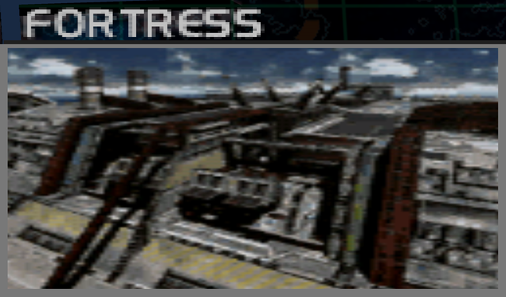
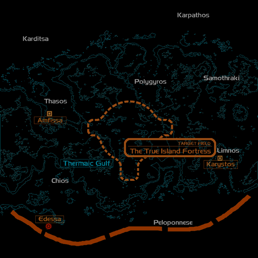
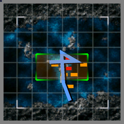

# Mission Data 

<table id="targetList" class="pageLinksTable">
  <tr>
    <td class ="tableImage" colspan="2"></td>
  </tr>
  <tr>
    <td>Location</td>
    <td>Meloss Fort</td>
  </tr>
  <tr>
    <td>Objective</td>
    <td>Destroy all Targets</td>
  </tr>
  <tr>
    <td>Time Limit</td>
    <td>10 Minutes</td>
  </tr>
  <tr>
    <td>Time of Day</td>
    <td>Noon</td>
  </tr>
</table>

# Briefing

  

It appeared as though our assault had silenced the fortress city, but we only succeeded in damaging its surface strata.
The Federation government is urging our forces to surrender, with one finger on the nuclear missile hidden away within the fortress.
We will not succumb to their ludicrous threats.
Your mission is to prevent the launch of the nuclear missile, and to neutralize the fortress.
This will be the last battlenot really, and their resistance should be that much more fierce.
Remove these obstacles, and clear the way to peace.
We're counting on you, lieutenant.

# Mission Map

  

# Enemy List
|Name|Type|Quantity|Score|
|-|-|-|-|
|Nuclear Missile|Target - Ground|6|6,800|
|Facility Building|Target - Ground|7|7,500|
|Gun Pod|Target - Ground|6|4,500|
|Missile Pod|Target - Ground|10|6,000|
|[F-22 Raptor](/aircraft/29_f-22)|Target - Air|2|85,500|
|[F-22 Raptor](/aircraft/29_f-22)|Enemy - Air|2|57,000|
|[JAS39 Gripen](/aircraft/22_jas39)|Enemy - Air|2|43,000|
|[F-14D Tomcat](/aircraft/17_f-14d)|Enemy - Air|2|46,000|
|[X-32 JSF](/aircraft/30_x-32)|Enemy - Air|2|55,000|
|[F-14D Tomcat](/aircraft/17_f-14d)|Enemy - Air|2|46,000|
|[YF-23 Blackwidow](/aircraft/27_yf-23)|Enemy - Air|2|56,000|

# Unlock Reward
None

# Mission Guide
Same deal as before, except with tougher enemy air superiority, more durable facility buildings and six nuclear missiles to destroy. The missiles can be destroyed with guns so ammo can be conserved to deal with enemy fighters and the F-22 Ace.