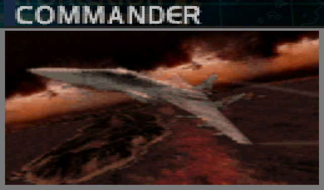
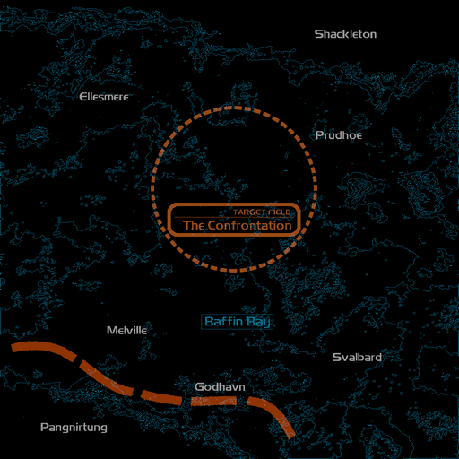
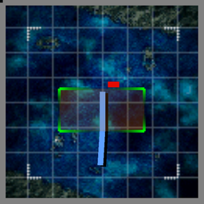

# Mission Data 

<table id="targetList" class="pageLinksTable">
  <tr>
    <td class ="tableImage" colspan="2"></td>
  </tr>
  <tr>
    <td>Location</td>
    <td>Sea of Karvadoss</td>
  </tr>
  <tr>
    <td>Objective</td>
    <td>Shoot down the Target</td>
  </tr>
  <tr>
    <td>Time Limit</td>
    <td>10 Minutes</td>
  </tr>
  <tr>
    <td>Time of Day</td>
    <td>Dusk</td>
  </tr>
</table>

# Briefing

  

I have a message for you from Colonel Zan Daas, the commander of the former Dzavailar Air Force.
It says, 'I will be on the beach of the fortress city.'
The colonel was one of the leaders of the Federational Revolution.
No doubt many of the old military's soldiers followed him into this war out of personal loyalty to him.
A People's Revolution delegate has just requested the opening of a peace dialogue.
Go and finish our war.

# Mission Map

  

# Enemy List
|Name|Type|Quantity|Score|
|-|-|-|-|
|[MiG-1.44 MFI](/aircraft/31_mig-144)|Target - Air|1|180,000|

# Unlock Reward
- [MiG-1.44 MFI](/aircraft/31_mig-144) (Requires Gun kill on Easy or lower difficulty)
- New Game+ (On first time clear, save after the credits roll then load that save file)

# Mission Guide
The final battle pits the player in an one-on-one duel against Zan Daas in MiG-1.44 MFI. His plane is much more tougher than any other fighters (including Aces) encountered before, but since his AI aggression isn't any different to regular enemies he shouldn't pose too much threat against endgame aircraft.

By finishing off Zan Daas' MiG-1.44 with guns, the MiG-1.44 MFI is unlocked for purchase on Easy or lower difficulty.