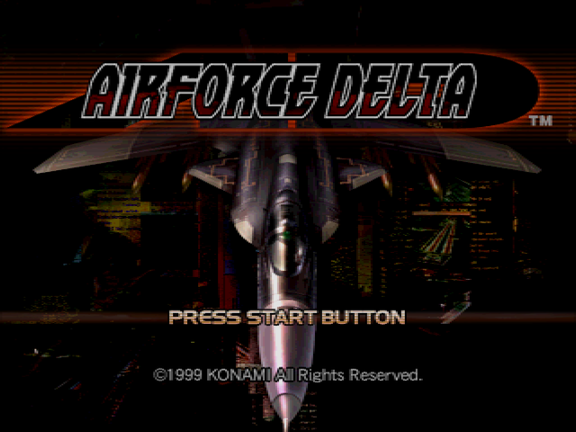

  

## Game Completion Rewards

After completing the game for the first time, the title screen will be replaced with red Airforce Delta logo and S-37 in the background instead of blue logo with F-22 Raptor background. When selecting a new game, cleared difficulty is marked by triangle icon.

The following options are available after loading the game completion save. These options do carry over when starting a new game:
- Custom HUD Color: Unlocked by completing the game on Hard difficulty. This option can be accessed from HUD Set, Color menu. A new option, "Custom" will be available that allows the player to use custom color on normal and missile alert HUD
- Unlimited Missiles: Unlocked by completing the game on Normal difficulty or higher. "Special Arms" option will be available at Special menu from the Options screen.

The following aircraft are made available after completing the game on specific difficulty level:
- [F/A-18C Hornet](/aircraft/13_fa-18c), [Sea Harrier](/aircraft/07_sea-harrier), [AV-8B Harrier II](/aircraft/10_av-8b), [F-15E Strike Eagle](/aircraft/18_f-15e), [Su-27B Flanker](/aircraft/20_su-27), [Su-34 Platypus](/aircraft/24_su-34): Complete the game on any difficulty level
- [S-37 Berkut](/aircraft/28_s-37): Complete the game on Easy or higher difficulty. Can be unlocked earlier at any difficulty by shooting it down with guns at Mission 17: [Mobile Infantry](/missions/m17-mobile-infantry)
- [MiG-1.44 MFI](/aircraft/31_mig-144): Complete the game on Normal or higher difficulty. Can be unlocked earlier at any difficulty by shooting it down with guns at Mission 20: [The Confrontation](/missions/m20-the-confrontation)
- [English Electric Lightning/F6](/aircraft/01_ee-lightning): Complete the game on Hard or higher difficulty. Can be unlocked earlier at any difficulty by shooting it down with guns at Mission 3: [Military Supply Base](/missions/m03-military-supply-base)
## Hide Replay UI

Press and hold X+Y during replay mode to hide the Replay UI text.